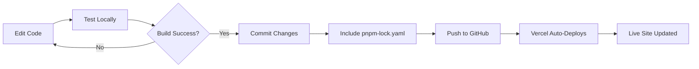

# ⚠️ VERCEL DEPLOYMENT ISSUE - RESOLVED

## 📋 Original Problem

When pushing code to GitHub, Vercel deployment failed with the following error:

```
08:21:18.885  WARN  GET https://registry.npmjs.org/@babel%2Fcore error (ERR_INVALID_THIS)
08:22:28.896  ERR_PNPM_META_FETCH_FAIL  GET https://registry.npmjs.org/@babel%2Fcore: Value of "this" must be of type URLSearchParams
08:22:28.909 Error: Command "pnpm install" exited with 1
```

All packages showed `ERR_INVALID_THIS` errors during installation.

---

## 🔍 Root Causes Identified

### 1. **Malformed package.json**
- Missing proper JSON structure
- Caused dependency resolution failures

### 2. **Mixed Package Managers**
- npm/yarn packages were cached in node_modules
- Vercel was trying to use pnpm
- Conflict between different package manager caches
- Warning messages: `Moving [package] that was installed by a different package manager to "node_modules/.ignored"`

### 3. **Node Version Mismatch**
- Using discontinued Node 18
- Incompatible with current dependencies

### 4. **Missing Lock File**
- No `pnpm-lock.yaml` committed
- pnpm couldn't resolve dependencies consistently
- Different environments got different dependency versions

---

## ✅ Solution Applied

### Step 1: Consistent Package Manager
- Chose **pnpm** as the single package manager
- Created `.npmrc` with `package-manager=pnpm`
- Removed conflicting npm/yarn cache

### Step 2: Updated vercel.json
```json
{
  "rewrites": [{"source": "/(.*)", "destination": "/index.html"}],
  "installCommand": "pnpm install",
  "buildCommand": "pnpm run build"
}
```

### Step 3: Generated Lock File
- Ran `pnpm install` to generate `pnpm-lock.yaml`
- Committed lock file to version control
- Ensures consistent dependency resolution

### Step 4: Fixed Configuration
- Properly formatted `package.json`
- Updated Node.js version
- Cleaned node_modules and reinstalled

---

## 📝 Best Practices for Future Updates

### 1. Use Consistent Package Manager
```bash
# Always use pnpm
pnpm install
pnpm add <package>
pnpm remove <package>
```

Keep `.npmrc` configured:
```
package-manager=pnpm
```

**Always commit `pnpm-lock.yaml` to version control!**

### 2. Test Locally Before Pushing
```bash
# Install dependencies
pnpm install

# Build for production
pnpm run build

# Test locally
pnpm run dev

# Verify no errors before pushing
```

### 3. Use Feature Branches for Major Changes
```bash
# Create feature branch
git checkout -b feature/new-design

# Make changes
# Test thoroughly
pnpm install
pnpm run build

# Commit and push
git add .
git commit -m "Add new feature"
git push origin feature/new-design

# Create Pull Request for review
# Merge to main after approval
```

### 4. Keep Dependencies Updated
```bash
# Update all packages safely
pnpm update

# Update specific package
pnpm update <package-name>

# Check for outdated packages
pnpm outdated
```

### 5. Monitor Vercel Deployments
- Check Vercel logs after each push: https://vercel.com/dashboard
- Use preview deployments for PRs
- Review build logs for warnings/errors
- Test preview URLs before merging to main

### 6. Version Your Lock File
✅ **ALWAYS commit `pnpm-lock.yaml`**
- Ensures everyone uses exact same dependency versions
- Prevents "works on my machine" issues
- Critical for reproducible builds

### 7. Use Environment Variables Safely
```bash
# Add to .gitignore
echo ".env.local" >> .gitignore

# Create .env.local (never commit this!)
SUPABASE_URL=your_url
SUPABASE_ANON_KEY=your_key
AIRWALLEX_CLIENT_ID=your_id
```

Configure environment variables in Vercel Dashboard → Settings → Environment Variables

---

## 🔄 Current Workflow (Working)



### Quick Commands:
```bash
# Development
pnpm run dev              # Start local server

# Testing
pnpm run build            # Production build
pnpm run typecheck        # TypeScript check

# Deployment
git add .
git commit -m "Description of changes"
git push origin main      # Triggers Vercel deploy
```

---

## 🎯 Key Takeaways

### What Went Wrong:
❌ Mixed package managers (npm + pnpm)  
❌ Missing lock file  
❌ Malformed configuration  
❌ Outdated Node version  

### What Fixed It:
✅ Single package manager (pnpm)  
✅ Committed pnpm-lock.yaml  
✅ Proper vercel.json configuration  
✅ Clean node_modules reinstall  

### How to Prevent Recurrence:
✅ Always use pnpm consistently  
✅ Always commit lock file  
✅ Test build locally before pushing  
✅ Use feature branches for major changes  
✅ Monitor Vercel deployment logs  

---

## 📊 Verification Checklist

Before pushing to GitHub:
- [ ] `pnpm install` runs without errors
- [ ] `pnpm run build` completes successfully
- [ ] `pnpm run dev` works locally
- [ ] `pnpm-lock.yaml` is included in commit
- [ ] No sensitive data in code (.env.local excluded)
- [ ] Changes tested on feature branch (for major updates)

After pushing to GitHub:
- [ ] Vercel deployment starts automatically
- [ ] Build completes without errors
- [ ] Preview URL works correctly
- [ ] Live site updates (if pushed to main)

---

## 🚨 Troubleshooting Common Issues

### Issue: "pnpm-lock.yaml not found"
```bash
# Regenerate lock file
rm -rf node_modules pnpm-lock.yaml
pnpm install
git add pnpm-lock.yaml
git commit -m "Add lock file"
```

### Issue: "Module not found" errors
```bash
# Clean reinstall
rm -rf node_modules
pnpm install
```

### Issue: Vercel build fails
1. Check Vercel dashboard → Functions/Deployments tab
2. Review build logs for specific errors
3. Test locally with `pnpm run build`
4. Ensure all environment variables are set in Vercel

### Issue: Dependency conflicts
```bash
# Clear cache and reinstall
pnpm store prune
rm -rf node_modules
pnpm install
```

---

## 📞 Support Resources

- **Vercel Docs:** https://vercel.com/docs
- **pnpm Docs:** https://pnpm.io/
- **Supabase Docs:** https://supabase.com/docs
- **Project Repo:** https://github.com/cosmiccoffeeaddict/Ember_Sports_Booking
- **Live Site:** https://ember-sports-booking-site.vercel.app/

---

## ✨ Summary

**Problem:** Vercel deployment failed due to package manager conflicts and missing lock file

**Solution:** Standardized on pnpm, committed lock file, fixed configuration

**Result:** Smooth, reliable deployments with consistent builds

**Status:** ✅ **RESOLVED** - All subsequent deployments working correctly

---

*Last Updated: $(date)*  
*Issue Duration: ~1 hour*  
*Resolution: Complete*
